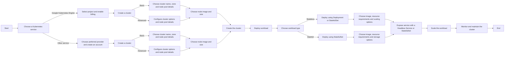

```mermaid
graph LR
A[Start] --> B[Choose a Kubernetes service]
B --> |Google Kubernetes Engine| C[Select project and enable billing]
B --> |Other service| D[Choose preferred provider and create an account]
C --> E[Create a cluster]
D --> F[Create a cluster]
E --> |Basic| G[Choose cluster name, zone and node pool details]
E --> |Advanced| H[Configure cluster options and node pool details]
F --> |Basic| I[Choose cluster name, zone and node pool details]
F --> |Advanced| J[Configure cluster options and node pool details]
G --> K[Choose node image and size]
H --> K[Choose node image and size]
I --> L[Choose node image and size]
J --> L[Choose node image and size]
K --> M[Create the cluster]
L --> M[Create the cluster]
M --> N[Deploy workload]
N --> O[Choose workload type]
O --> |Stateless| P[Deploy using Deployment or StatefulSet]
O --> |Stateful| Q[Deploy using StatefulSet]
P --> R[Choose image, resource requirements and scaling options]
Q --> S[Choose image, resource requirements and storage options]
R --> T[Expose service with a LoadBalancer]
S --> T[Expose service with a Headless Service or StatefulSet]
T --> U[Scale the workload]
U --> V[Monitor and maintain the cluster]
V --> W[End]
```