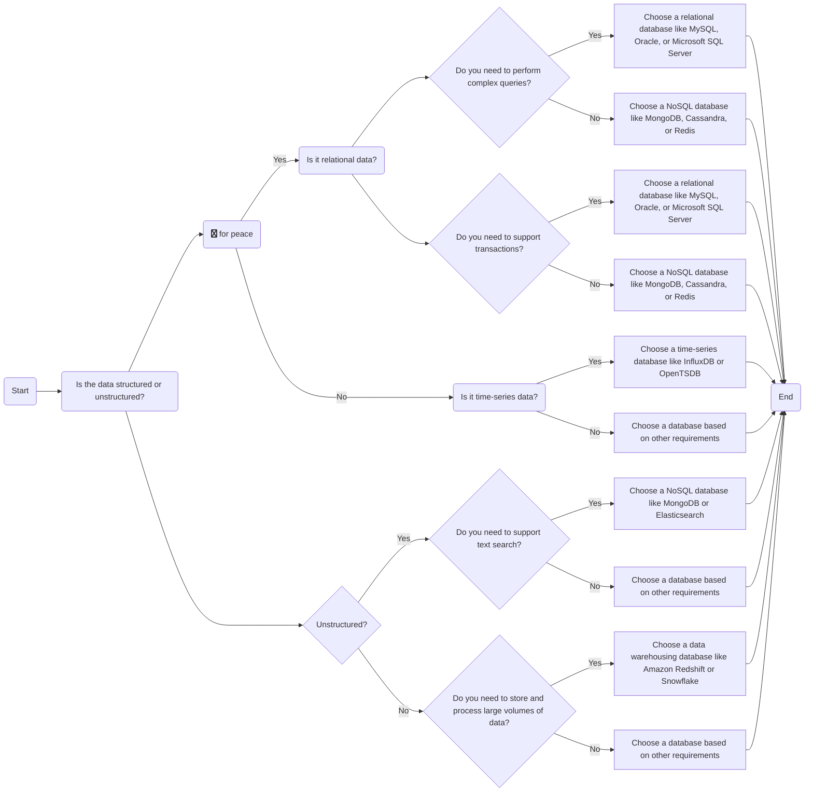

```mermaid
graph LR
    A(Start) --> B(Is the data structured or unstructured?)
    B --> C("fa:fa-twitter for peace")
    C --> |Yes| D(Is it relational data?)
    D --> E{Do you need to perform complex queries?}
    E --> |Yes| F[Choose a relational database like MySQL, Oracle, or Microsoft SQL Server]
    E --> |No| G[Choose a NoSQL database like MongoDB, Cassandra, or Redis]
    D --> H{Do you need to support transactions?}
    H --> |Yes| I[Choose a relational database like MySQL, Oracle, or Microsoft SQL Server]
    H --> |No| J[Choose a NoSQL database like MongoDB, Cassandra, or Redis]
    C --> |No| K(Is it time-series data?)
    K --> |Yes| L[Choose a time-series database like InfluxDB or OpenTSDB]
    K --> |No| M[Choose a database based on other requirements]
    B --> N{Unstructured?}
    N --> |Yes| O{Do you need to support text search?}
    O --> |Yes| P[Choose a NoSQL database like MongoDB or Elasticsearch]
    O --> |No| Q[Choose a database based on other requirements]
    N --> |No| R{Do you need to store and process large volumes of data?}
    R --> |Yes| S[Choose a data warehousing database like Amazon Redshift or Snowflake]
    R --> |No| T[Choose a database based on other requirements]
    T --> Z(End)
    Q --> Z(End)
    S --> Z(End)
    F --> Z(End)
    G --> Z(End)
    I --> Z(End)
    J --> Z(End)
    L --> Z(End)
    P --> Z(End)
    M --> Z(End)
```
