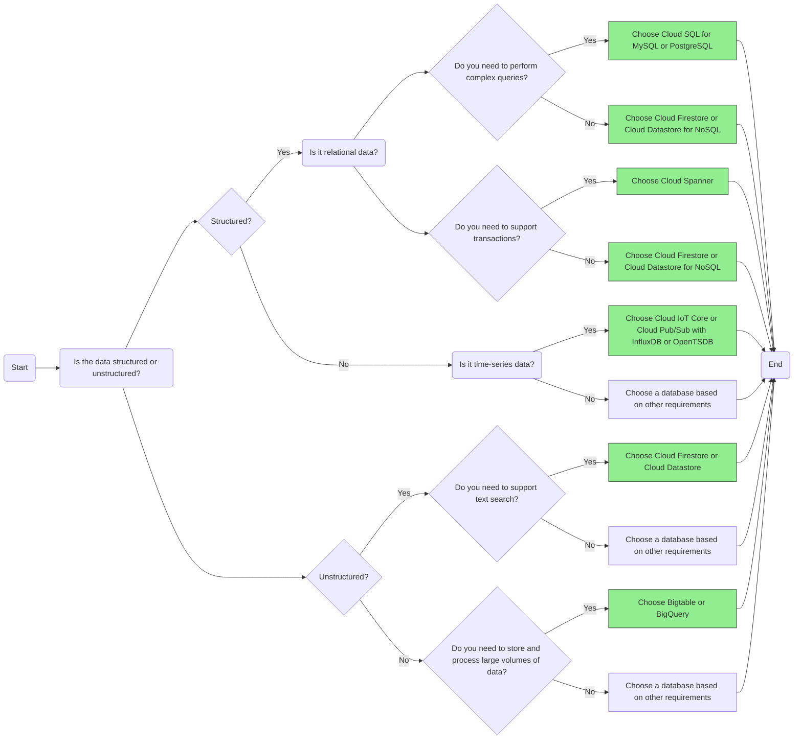
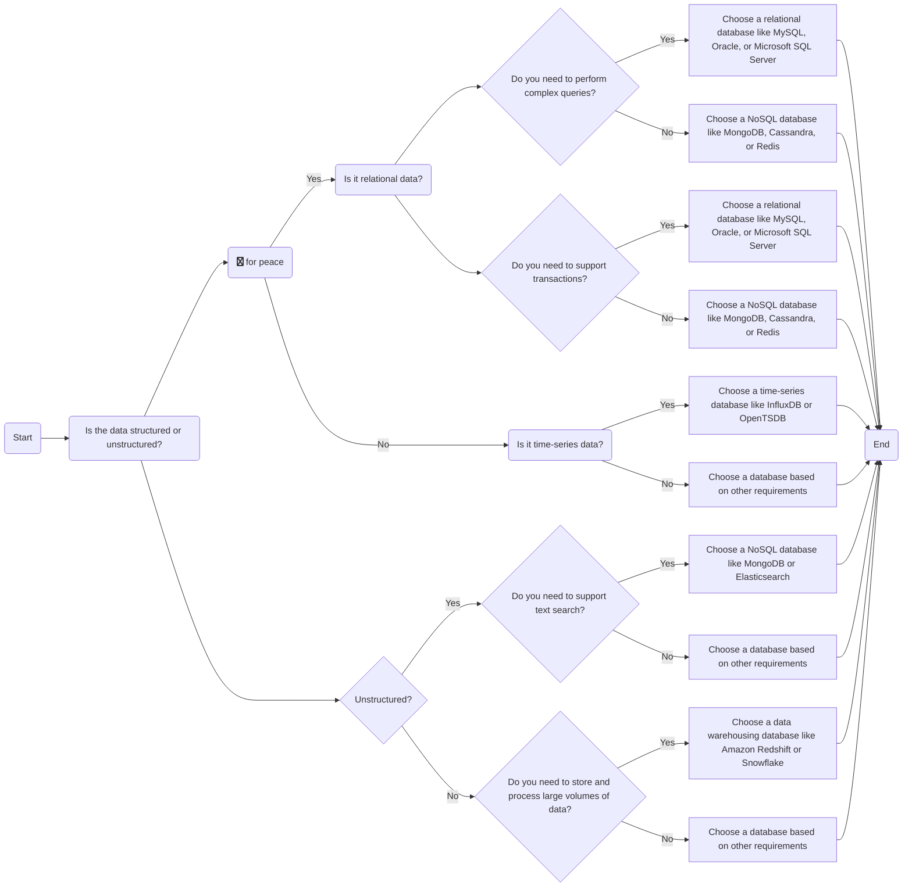

```mermaid
flowchartLR
    flowchart Deploying a Kubernetes Cluster
    subgraph Start
        A[Make a Plan]
        B[Choose a Kubernetes Service]
    end
    subgraph Configure Cluster
        C[Select Project and Enable Billing]
        D[Create a Cluster]
        E[Configure Cluster Options]
        F[Choose Node Pool Details]
    end
    subgraph Choose Node Type
        G[Choose Basic or Advanced]
    end
    subgraph Basic
        H[Choose Cluster Name]
        I[Choose Zone]
        J[Choose Node Pool Details]
        K[Choose Node Image and Size]
    end
    subgraph Advanced
        L[Choose Cluster Name]
        M[Configure Kubernetes API Access]
        N[Configure Workload Identity]
        O[Configure Logging and Monitoring]
        P[Configure Network]
        Q[Configure Security]
        R[Choose Node Pool Details]
        S[Choose Node Image and Size]
    end
    subgraph Deploy Workload
        T[Deploy Workload]
        U[Choose Workload Type]
    end
    subgraph Stateless
        V[Deploy using Deployment or StatefulSet]
        W[Choose Image]
        X[Choose Resource Requirements]
        Y[Choose Scaling Options]
        Z[Expose Service with a LoadBalancer]
    end
    subgraph Stateful
        AA[Deploy using StatefulSet]
        AB[Choose Image]
        AC[Choose Resource Requirements]
        AD[Choose Storage Options]
        AE[Expose Service with a Headless Service or StatefulSet]
    end
    subgraph Scale Workload
        AF[Scale the Workload]
        AG[Choose Scaling Method]
        AH[Monitor and Maintain the Cluster]
    end
    subgraph End
        AI[Done]
    end

    A --> B
    B --> C
    C --> D
    D --> E
    E --> G
    G --> Basic
    Basic --> H
    H --> I
    I --> J
    J --> K
    G --> Advanced
    Advanced --> L
    L --> M
    M --> N
    N --> O
    O --> P
    P --> Q
    Q --> R
    R --> S
    S --> T
    T --> U
    U --> Stateless
    U --> Stateful
    Stateless --> V
    V --> W
    W --> X
    X --> Y
    Y --> Z
    Stateful --> AA
    AA --> AB
    AB --> AC
    AC --> AD
    AD --> AE
    AE --> Z
    Z --> AF
    AF --> AG
    AG --> AH
    AH --> AI
```


